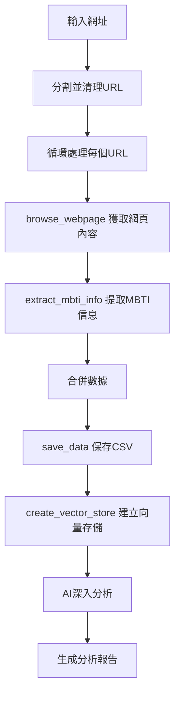
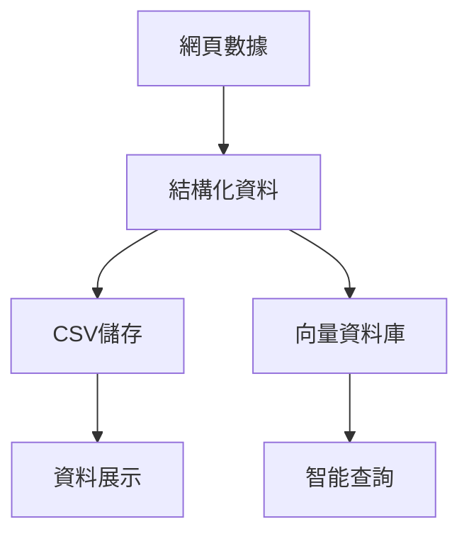

# MBTI 性格分析工具(基於SmolAgent智能代理系統說明)

這是一個基於 Python 的 MBTI（Myers-Briggs Type Indicator）性格分析工具，可以爬取、分析和查詢 MBTI 相關數據。

# MBTI 分析工具系統運作流程

SmolAgent 是一個輕量級的智能代理系統，主要負責 MBTI 數據的深度分析和報告生成。系統設計遵循「小而精」的原則，專注於特定領域的分析任務。

## 一、系統架構概述

系統主要由三個核心模組組成：
1. 數據處理模組
2. 數據查看模組
3. 自定義查詢模組

## 二、詳細運作流程

### 1. 數據處理模組



處理步驟：
- 接收多個目標網址輸入
- 對每個網址進行爬取和分析
- 即時更新處理進度
- 生成結構化分析報告

### 2. 數據查看模組


功能特點：
- 動態載入CSV檔案列表
- 支援檔案選擇和刷新
- 表格化顯示MBTI資料
- 支援動態分頁

### 3. 自定義查詢模組


查詢功能：
- 自然語言查詢介面
- 向量化搜尋
- 智能問答系統

## 三、資料流向

### 資料處理流程


### 檔案儲存結構
```
mbti_data/
├── csv/
│   └── mbti_browser_YYYYMMDD_HHMMSS.csv
└── vectors/
    └── 向量化索引檔案
```

## 四、使用注意事項

1. 資料處理
   - 確保網址格式正確
   - 等待進度更新完成
   - 注意網路連接狀態

2. 資料查看
   - 定期刷新檔案列表
   - 檢查CSV檔案完整性

3. 查詢功能
   - 使用清晰的查詢語句
   - 避免過於複雜的問題

## 五、錯誤處理機制

系統內建多重錯誤處理：
- 網頁存取錯誤處理
- 資料解析異常處理
- 檔案讀寫錯誤處理
- 查詢超時保護

## 六、安裝需求

1. Python 3.8 或更高版本
2. 安裝所需套件：

```bash
pip install -r requirements.txt
```

## 七、使用方法

### 參數設定：

請將`.env.example`複製為`.env`，並填入相應的API金鑰
```bash
cp .env.example .env
```

### 執行分析：

使用gradio介面
```bash
python mbti_browser_gradio.py
```

## 八、授權
MIT License

## 九、Azure DevOps 部署相關指令

# 列出所有可用的訂閱
```bash
az account list --output table

# 切換到正確的訂閱
az account set --subscription "Azure for Students"

# 列出當前用戶的訂閱ID
az account list --query "[?isDefault].id" -o tsv


# 獲取當前登入的服務主體 ID
CURRENT_SP_ID=$(az ad signed-in-user show --query id -o tsv)

# 建立倉庫拉取、推送權限
az role assignment create \
--assignee $(az ad signed-in-user show --query id -o tsv) \
--role AcrPull \
--scope /subscriptions/$(az account show --query "id" -o tsv)/resourceGroups/AIChatBot/providers/Microsoft.ContainerRegistry/registries/acrmbtianlyzer

az role assignment create \
--assignee $(az ad signed-in-user show --query id -o tsv) \
--role AcrPush \
--scope /subscriptions/$(az account show --query "id" -o tsv)/resourceGroups/AIChatBot/providers/Microsoft.ContainerRegistry/registries/acrmbtianlyzer


# 列出指定倉庫下所有權限
az role assignment list --assignee $(az ad signed-in-user show --query id -o tsv) --scope /subscriptions/$(az account show --query "id" -o tsv)/resourceGroups/AIChatBot/providers/Microsoft.ContainerRegistry/registries/acrmbtianlyzer --query "[].roleDefinitionName" -o table

# 查看即時LOG
az webapp log tail --name app-mbti-analyzer --resource-group AIChatBot
```